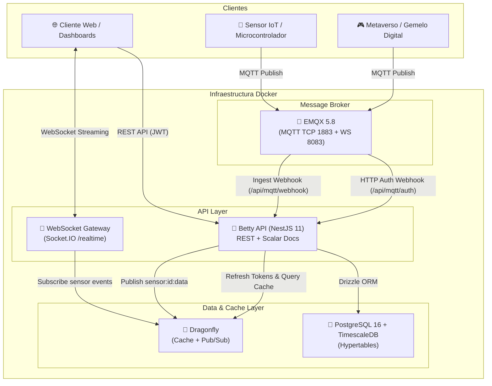

# 🚀 Betty API — PaaS IoT Open Source para Comunidades Universitarias y Gemelos Digitales

<p align="center">
  
</p>

<p align="center">
  <strong>Plataforma abierta de Internet de las Cosas (IoT) y Gemelos Digitales orientada a investigación académica y metaversos universitarios.</strong>
</p>

<p align="center">
  
  
  
  
  
  
  
  
</p>

---

## 🌟 Características Principales

- 📡 **Ingesta IoT ultrarrápida**: Broker MQTT autohosteado (**EMQX 5.8**) con autenticación HTTP vía API Keys criptográficas por sensor (`betty_live_...`).
- 🎮 **Soporte Multiorigen**: Ingesta diferenciada tanto de sensores físicos IoT (`origin_type: sensor`) como de simulaciones de mundos virtuales (`origin_type: metaverso`).
- 👥 **Roles Duales y Modelo RBAC Unificado**:
  - **Roles del Sistema (`scope: system`)**: `admin` (control total de plataforma y usuarios) y `user` (investigador/estudiante estándar).
  - **Roles de Equipo (`scope: team`)**: `owner`, `team_admin`, `member` y `viewer` con permisos granulares almacenados en formato JSONB.
- 👥 **Equipos de Investigación**: Grupos de trabajo colaborativos con invitaciones mediante código alfanumérico (8 caracteres) y enlaces seguros con token temporal de 7 días.
- 🔒 **Sensores Privados o de Equipo**: Sensores personales de uso exclusivo o compartidos dentro de equipos de investigación.
- 📊 **Múltiples Tableros (N Dashboards)**: Cada usuario puede crear tableros ilimitados con cuadrículas interactivas y 6 tipos de widgets (`line_chart`, `gauge`, `table`, `map`, `metric`, `bar_chart`).
- 🌐 **Publicación de Dashboards Públicos**: Tableros que pueden publicarse libremente para acceso abierto a estudiantes o pantallas del campus sin requerir login (`GET /api/dashboards/public/:id`).
- 🔌 **Visualización en Tiempo Real**: WebSocket Gateway (Socket.IO en `/realtime`) sincronizado mediante el canal Pub/Sub multihilo de **Dragonfly**.
- 🔐 **Autenticación Dual & Seguridad**: Google OAuth 2.0 (Google Cloud Console) y Email/Contraseña con hasheo `bcrypt`, JWT, Refresh Tokens en memoria y reseteo de contraseña vía **Resend**.
- 🐉 **Cache de Alto Rendimiento**: **Dragonfly** autohosteado (100% compatible con Redis RESP, multihilo) para caché de series temporales y eventos Pub/Sub.
- 🐘 **Series Temporales Eficientes**: **PostgreSQL 16** con extensión **TimescaleDB** (hypertables con particionamiento automático por tiempo) y **Drizzle ORM**.
- 📑 **Documentación Interactiva Moderna**: **Scalar** sobre OpenAPI disponible en `/api/docs` con tema oscuro y cliente de pruebas integrado.
- 🌐 **Internacionalización (i18n)**: Soporte nativo para español (`es`) e inglés (`en`).

---

## 🏗️ Arquitectura del Sistema



---

## 🛠️ Stack Tecnológico

| Componente | Tecnología | Propósito |
|:---|:---|:---|
| **Runtime** | Node.js 22 LTS + TypeScript 5.9 | Entorno de ejecución y tipado estático |
| **Framework** | NestJS 11 | Arquitectura modular enterprise con Inyección de Dependencias |
| **ORM** | Drizzle ORM 0.40 | Mapeo objeto-relacional SQL-first de alto rendimiento |
| **Base de Datos** | PostgreSQL 16 + TimescaleDB | Almacenamiento relacional y hypertables de series temporales |
| **Cache & Pub/Sub** | Dragonfly | Cache en memoria multihilo compatible con Redis RESP |
| **Broker MQTT** | EMQX 5.8 (Open Source) | Broker MQTT escalable con HTTP Auth y Rule Engine |
| **Realtime** | Socket.IO + @nestjs/websockets | Streaming de métricas en tiempo real hacia los tableros |
| **Documentación** | Scalar (@scalar/nestjs-api-reference) | Interfaz interactiva OpenAPI con tema oscuro |
| **Email** | Resend | Envío de correos transaccionales (reseteo de contraseña e invitaciones) |
| **Auth** | Passport.js + JWT + Google OAuth 2.0 | Autenticación robusta dual |
| **Internacionalización** | nestjs-i18n | Respuestas y errores multi-idioma (es, en) |
| **Package Manager** | pnpm 10 | Gestor de paquetes ultrarrápido |

---

## 🚀 Inicio Rápido con Docker

### 1. Clonar y configurar variables de entorno

```bash
cp .env.example .env
```

Edita `.env` con tus claves (Google Client ID, Resend API Key, etc.).

### 2. Levantar toda la infraestructura

```bash
docker compose up -d
```

Esto iniciará automáticamente:
- **PostgreSQL 16 + TimescaleDB** en el puerto `5432`
- **Dragonfly Cache** en el puerto host `6380` (interno `6379`)
- **EMQX MQTT Broker** en los puertos `1883` (MQTT TCP), `8083` (WS) y `18083` (Dashboard)
- **Betty API (Modo Desarrollo con Hot-Reload)** en el puerto `3000`

---

## 💻 Desarrollo Local (sin Docker para la API)

Si prefieres ejecutar las bases de datos en Docker y la API directamente en tu host:

```bash
# 1. Instalar dependencias
pnpm install

# 2. Levantar dependencias en Docker
docker compose up postgres dragonfly emqx -d

# 3. Aplicar migraciones Drizzle
pnpm run db:push

# 4. Iniciar API en modo desarrollo con hot-reload
pnpm run start:dev
```

### 🌐 URLs del Entorno:
- **API Base:** [http://localhost:3000/api](http://localhost:3000/api)
- **Documentación Interactiva (Scalar):** [http://localhost:3000/api/docs](http://localhost:3000/api/docs)
- **WebSocket Gateway:** `ws://localhost:3000/realtime`
- **Dashboard EMQX:** [http://localhost:18083](http://localhost:18083) (Usuario: `admin`, Contraseña: `public_admin`)

---

## 📡 Guía de Conexión para Sensores IoT y Metaversos

### 1. Registrar Sensor en la API
Realiza una petición a `POST /api/sensors`:
```json
{
  "name": "Estación Meteorológica Campus",
  "teamId": "id-del-equipo-opcional",
  "metadata": {
    "model": "ESP32 + BME280",
    "location": "Campus Central - Laboratorio 3"
  }
}
```

**Respuesta:**
```json
{
  "id": "7b8f9e12-3456-4abc-9def-123456789abc",
  "name": "Estación Meteorológica Campus",
  "mqttTopic": "betty/sensor/7b8f9e12-3456-4abc-9def-123456789abc/data",
  "rawApiKey": "betty_live_a1b2c3d4e5f6...",
  "warning": "Guarda tu rawApiKey, no se volverá a mostrar."
}
```

### 2. Publicar Datos mediante MQTT
El microcontrolador (ESP32, Raspberry Pi, Arduino) o simulador de metaverso se conecta a EMQX:
- **Broker Host:** `localhost` (o IP del servidor)
- **Puerto:** `1883`
- **Username:** `<sensor_id>` (ej. `7b8f9e12-3456-4abc-9def-123456789abc`)
- **Password:** `<rawApiKey>` (ej. `betty_live_a1b2c3d4e5f6...`)
- **Topic:** `betty/sensor/<sensor_id>/data`

**Ejemplo de Payload desde Sensor Físico:**
```json
{
  "origin_type": "sensor",
  "temperature": 23.8,
  "humidity": 62.5,
  "pressure": 1013.2,
  "battery_voltage": 3.7
}
```

**Ejemplo de Payload desde Gemelo Digital / Metaverso:**
```json
{
  "origin_type": "metaverso",
  "avatar_count": 45,
  "fps": 60,
  "zone": "Auditorio Principal Virtual"
}
```

### 3. Publicación de prueba con CLI (Mosquitto):
```bash
mosquitto_pub -h localhost -p 1883 \
  -u "7b8f9e12-3456-4abc-9def-123456789abc" \
  -P "betty_live_a1b2c3d4e5f6..." \
  -t "betty/sensor/7b8f9e12-3456-4abc-9def-123456789abc/data" \
  -m '{"origin_type": "sensor", "temperature": 24.5, "humidity": 55}'
```

---

## 🧪 Pruebas Automatizadas

```bash
# Pruebas unitarias con Jest
pnpm test

# Pruebas con cobertura
pnpm run test:cov

# Compilación para producción
pnpm run build
```

---

## 📂 Estructura del Código Fuente

```
betty-api/
├── docker/                 # Scripts de inicialización Docker (Postgres/TimescaleDB)
├── docs/
│   ├── ARCHITECTURE_DECISION_RECORDS.md # Registro consolidado de decisiones
│   └── adr/                # 9 Architecture Decision Records individuales
├── src/
│   ├── common/             # Decoradores, filtros, interceptores y utilidades criptográficas
│   ├── config/             # Módulos de configuración tipada
│   ├── database/           # Schemas Drizzle ORM, migraciones y seeders
│   ├── i18n/               # Diccionarios de internacionalización (es, en)
│   └── modules/
│       ├── auth/           # Login Google/Email, JWT, reseteo de contraseña
│       ├── users/          # Gestión de perfiles y administración de usuarios
│       ├── roles/          # Gestión de roles del sistema y de equipo
│       ├── teams/          # Equipos, membresías y sistema de invitación
│       ├── sensors/        # Sensores, API Keys seguras y series temporales
│       ├── mqtt/           # Webhooks e integración con broker EMQX
│       ├── dashboards/     # Tableros públicos/privados y widgets configurables
│       ├── realtime/       # WebSocket Gateway (Socket.IO + Dragonfly)
│       ├── cache/          # Servicio de Dragonfly Cache & Pub/Sub
│       └── email/          # Integración transaccional con Resend
├── Dockerfile              # Construcción multi-etapa optimizada
├── docker-compose.yml      # Entorno de desarrollo completo
└── docker-compose.prod.yml # Entorno de producción
```

---

## 📄 Licencia

Este proyecto está bajo la Licencia **MIT** — Código abierto para la comunidad académica y de investigación.
